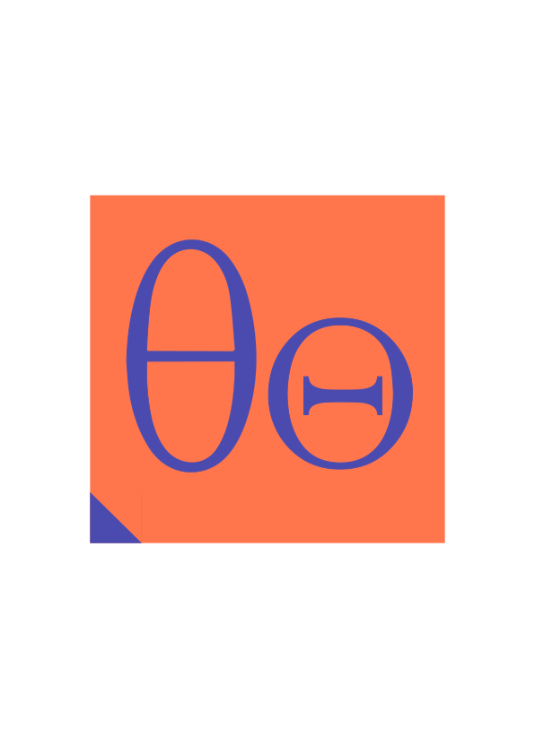

#  theta

Rust CLI for managing agent configurations defined by [theta-spec](https://theta-spec.tamarillo.ai/).

## Installation

```bash
curl -sfL https://raw.githubusercontent.com/tamarillo-ai/theta/main/scripts/install.sh | bash
```

## Quick start

```bash
theta init                                     # scaffold theta.toml
theta add rule python-types                    # add a rule
theta add tool fetch --command "uvx mcp-fetch" # mcp tool manual addition
theta add tool agency.lona/trading             # mcp tool add from registry
theta add skill deploy org/skills@main         # GitHub shorthand
theta check                                    # validate everything
theta cast to claude-code                      # --> CLAUDE.md + .mcp.json + .claude/
```

## What it does

theta reads `theta.toml` and resolves, locks, materializes, and casts agent configurations to any supported harness by solving resources in a common `.theta/` folder. Like a package manager but for agent harness resources.

## Create from harnesses

Natively supported harnesses include:

- Claude Code
- Codex CLI
- GitHub Copilot
- Cursor

```bash
cd /path/to/your/project
theta cast from claude-code
```

### Commands

| Group | Commands |
|---|---|
| **Lifecycle** | `init`, `check`, `lock`, `sync`, `cast to`, `cast from`, `tree` |
| **Dependencies** | `add rule/system/tool/skill/subagent`, `rm rule/system/tool/skill/subagent` |
| **Inspection** | `describe`, `list rules/tools/skills/subagents` |
| **System store** | `register skill/rule/agent`, `list store`, `rm store`, `init --from` |

## Documentation

Full docs: [theta](https://theta.tamarillo.ai/), and it is more than recommended to read [theta-spec](https://theta-spec.tamarillo.ai/) first, given that this is the standard that theta implements against.


- [Getting started](docs/getting-started.md)
- [Concepts](docs/concepts/index.md) — manifest, sources, locking, casting, system store
- [CLI reference](docs/reference/cli.md) — every verb, every flag
- [Settings](docs/reference/settings.md) — environment variables, directory overrides

Or alternatively build the docs locally:

```bash
uv run mkdocs serve --livereload
```

Regenerate CLI reference from clap definitions:

```bash
just gen-cli-docs
```

## Contributing

### Prerequisites

- [Rust](https://rustup.rs/) stable toolchain (see `rust-version` in `Cargo.toml` for MSRV)
- [just](https://github.com/casey/just) — task runner (`cargo install just`)
- [lefthook](https://github.com/evilmartians/lefthook) — git hooks ([installation guide](https://lefthook.dev/install/))

All other dev tools (nextest, deny, shear, typos) are installed via `just install-tools`.

### Setup

```bash
git clone git@github.com:tamarillo-ai/theta.git
cd theta
just setup   # installs dev tools, hooks, fetches deps
```

### Common tasks

```bash
just --list         # see all available recipes
just test           # local tests (no network)
just test-online    # tests including live registries
just check          # run all CI checks locally
just gen-cli-docs   # regenerate docs/reference/cli.md
just fmt            # format all code
```

### Conventions

- See [STYLE.md](STYLE.md) for documentation style
- `clippy::pedantic` is enabled workspace-wide — check `[workspace.lints.clippy]` in `Cargo.toml` for allowed lints

### Hypertextuality with `theta-spec`

`theta` is the canonical implementation of `theta-spec`. Behavioral changes in `theta` SHOULD be accompanied by a respective change in `theta-spec`. Hotfixes, refactors, and non-protocol changes MAY be pushed without a change in `theta-spec`. Version-modification-triggering changes MUST follow from a TEP.

## Acknowledgments

theta's architecture is heavily inspired by [uv](https://github.com/astral-sh/uv) by **astral**. Direct signals of devotion, admiration, and almost plagiarism include:

- **Settings cascade** — CLI flag > env var > default, inspired by `uv-settings` (cited in source)
- **Git fetch and cache** — 3-tier layout (db/checkouts/locks), system git CLI, url digest keying — derived from `uv-git`
- **Lock file design** — deterministic manifest hash, content hashing with `sha256:` prefix, staleness detection, and others
- **`toml_edit` for formatting preservation** — same approach as uv's `pyproject_mut`
- **Materialization lifecycle** — `.theta/` mirrors uv's `.venv/`: lock --> materialize --> verify consistency --> cleanup orphans
- **Output stack** — `owo-colors` + `anstream` + `fs-err` + `indicatif`

## See also

- [theta-spec](https://theta-spec.tamarillo.ai/) — the standard
- [Agent Skills spec](https://agentskills.io/specification) — skill packaging format
- [MCP](https://modelcontextprotocol.io/) — tool protocol
- [uv](https://github.com/astral-sh/uv) — architectural reference
