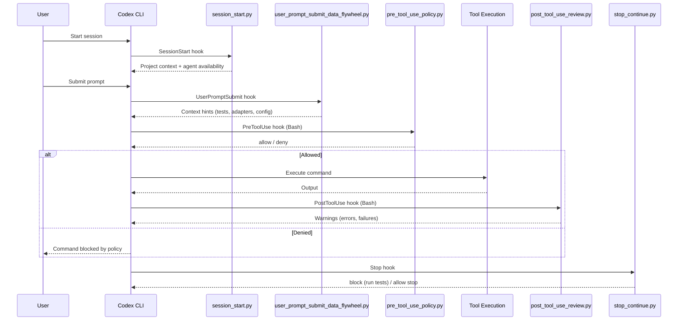
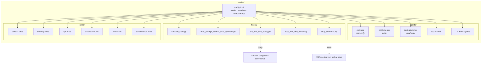

# `.codex/` — OpenAI Codex CLI Configuration

This directory configures [OpenAI Codex CLI](https://github.com/openai/codex) for the AI Coding Tools Orchestrator project. It defines the model, sandbox policy, 13 specialized sub-agents, 5 lifecycle hooks, and 6 domain rule files that govern how Codex operates in this repository.

## Directory Structure

```
.codex/
├── config.toml            — Global Codex CLI settings
├── hooks.json             — Hook registration manifest
├── agents/                — 13 specialized sub-agents (TOML)
│   ├── ai-ml-engineer.toml
│   ├── backend-api.toml
│   ├── code-reviewer.toml
│   ├── database-architect.toml
│   ├── devops-infrastructure.toml
│   ├── documentation-writer.toml
│   ├── explorer.toml
│   ├── implementer.toml
│   ├── mobile-developer.toml
│   ├── performance-engineer.toml
│   ├── security-specialist.toml
│   ├── test-runner.toml
│   └── web-frontend.toml
├── hooks/                 — 5 lifecycle hooks (Python)
│   ├── session_start.py
│   ├── user_prompt_submit_data_flywheel.py
│   ├── pre_tool_use_policy.py
│   ├── post_tool_use_review.py
│   └── stop_continue.py
└── rules/                 — 6 domain rule files
    ├── default.rules
    ├── aiml.rules
    ├── api.rules
    ├── database.rules
    ├── performance.rules
    └── security.rules
```

## `config.toml` — Global Settings

The root configuration file controls Codex CLI behavior for this project:

```toml
model = "o4-mini"                    # Default model for all agents
model_reasoning_effort = "medium"    # Reasoning depth (low/medium/high)

[project]
sandbox_mode = "workspace-write"     # Agents can write within the workspace

[agents]
max_threads = 6                      # Max concurrent sub-agent threads
max_depth = 1                        # Sub-agent nesting depth
job_max_runtime_seconds = 1800       # 30-minute timeout per agent job

[features]
codex_hooks = true                   # Enable lifecycle hooks
```

Key settings: agents run on `o4-mini` with medium reasoning effort. The sandbox restricts file writes to the workspace. Up to 6 agents can run concurrently, each with a 30-minute timeout.

## Agents

Each `.toml` file in `agents/` defines a specialized sub-agent with its own system prompt, sandbox mode, and domain expertise.

| Agent | Domain | Sandbox | Description |
|-------|--------|---------|-------------|
| `ai-ml-engineer` | AI/ML | `workspace-write` | ML pipelines, embeddings, LLM integration, RAG systems |
| `backend-api` | Backend | `workspace-write` | REST/GraphQL APIs, Flask/FastAPI, httpx, Pydantic |
| `code-reviewer` | Quality | `read-only` | Code review for correctness, security, architecture, style |
| `database-architect` | Data | `workspace-write` | Schema design, SQLite FTS5, query optimization, migrations |
| `devops-infrastructure` | DevOps | `workspace-write` | Docker, Kubernetes, CI/CD pipelines, IaC |
| `documentation-writer` | Docs | `workspace-write` | API docs, architecture docs, tutorials, Mermaid diagrams |
| `explorer` | Research | `read-only` | Read-only codebase exploration and architecture mapping |
| `implementer` | Coding | `workspace-write` | Feature implementation, bug fixes, targeted code changes |
| `mobile-developer` | Mobile | `workspace-write` | React Native, Flutter, iOS (Swift), Android (Kotlin) |
| `performance-engineer` | Performance | `workspace-write` | Profiling (cProfile, py-spy), load testing, optimization |
| `security-specialist` | Security | `read-only` | OWASP Top 10, vulnerability assessment, threat modeling |
| `test-runner` | Testing | *(default)* | Test execution, failure diagnosis, coverage analysis |
| `web-frontend` | Frontend | `workspace-write` | React, Vue, Angular, Tailwind, accessibility (WCAG 2.1) |

Read-only agents (`code-reviewer`, `explorer`, `security-specialist`) cannot modify files — they only analyze and report. All agents enforce the project's core rule: **zero shared imports** between `orchestrator/` and `agentic_team/`.

## Hooks

Hooks are Python scripts that fire at specific points in the Codex session lifecycle. They are registered in `hooks.json` and executed automatically by the Codex CLI.

### Hook Execution Order



### Hook Details

| Hook | Event | File | Purpose |
|------|-------|------|---------|
| **Session Start** | `SessionStart` | `session_start.py` | Loads project context (dual-system architecture, config paths) and detects available CLI agents (`claude`, `codex`, `gemini`) |
| **Data Flywheel** | `UserPromptSubmit` | `user_prompt_submit_data_flywheel.py` | Analyzes prompt keywords and injects relevant context hints (test commands, adapter locations, config paths, report generation) |
| **Pre-Tool Policy** | `PreToolUse` | `pre_tool_use_policy.py` | Blocks dangerous Bash commands (`rm -rf /`, `dd if=`, fork bombs) before execution; matcher: `Bash` only |
| **Post-Tool Review** | `PostToolUse` | `post_tool_use_review.py` | Scans command output for `SyntaxError`, `ModuleNotFoundError`, `FAILED`, etc. and surfaces warnings; 10s timeout |
| **Stop/Continue** | `Stop` | `stop_continue.py` | If the assistant modified Python files, blocks stop and requests test suite execution first; 30s timeout |

## Rules

Rule files in `rules/` define domain-specific policies using TOML-like syntax. Codex loads `default.rules` for all sessions and domain-specific rules when the context matches.

| Rule File | Domain | Key Policies |
|-----------|--------|-------------|
| `default.rules` | General | Allow pytest, python, formatters (black, isort, flake8, mypy), pip install; prompt on git writes; block `rm -rf /` |
| `security.rules` | Security | Input validation, parameterized queries, secrets management, secure coding patterns, security checklist |
| `api.rules` | API Design | REST conventions, consistent JSON responses, API versioning, rate limiting, error format standards |
| `database.rules` | Database | Schema design (snake_case, timestamps), indexing strategy, parameterized queries, migration management |
| `aiml.rules` | AI/ML | Data handling, model development, embeddings/vector search, LLM integration, RAG pipeline patterns, ethics |
| `performance.rules` | Performance | Profiling-first optimization, caching strategy, async patterns, memory management, latency percentiles |

## Architecture Overview



## How to Add New Components

### Adding a New Agent

1. Create `agents/<name>.toml`:
   ```toml
   name = "my_agent"
   description = "Short description for agent selection"
   model = "o4-mini"
   model_reasoning_effort = "high"
   sandbox_mode = "workspace-write"   # or "read-only"

   developer_instructions = """
   System prompt with domain expertise and project context.
   """

   nickname_candidates = ["Name1", "Name2", "Name3"]
   ```
2. The agent is automatically available — no registration needed.
3. Keep `sandbox_mode = "read-only"` for review/analysis-only agents.

### Adding a New Hook

1. Create `hooks/<event_name>.py` reading JSON from stdin, writing JSON to stdout.
2. Register it in `hooks.json` under the appropriate event (`SessionStart`, `UserPromptSubmit`, `PreToolUse`, `PostToolUse`, `Stop`).
3. Use a `matcher` to scope the hook (e.g., `"Bash"` for tool hooks).
4. Set a `timeout` (seconds) for hooks that may run long.

### Adding a New Rule File

1. Create `rules/<domain>.rules` using the `prefix_rule()` syntax:
   ```
   prefix_rule(
       pattern = ["command", "subcommand"],
       decision = "allow",            # allow | prompt | forbidden
       justification = "Why this rule exists",
   )
   ```
2. Decisions: `allow` (auto-approve), `prompt` (ask user), `forbidden` (block entirely).
3. Or use TOML section syntax for pattern-based guidance:
   ```toml
   [domain.category]
   description = "What these patterns cover"
   patterns = ["Pattern 1", "Pattern 2"]
   ```

## Related Documentation

- [AGENTS.md](../AGENTS.md) — Project-wide agent instructions
- [ARCHITECTURE.md](../ARCHITECTURE.md) — System architecture
- [docs/](../docs/) — Full project documentation
