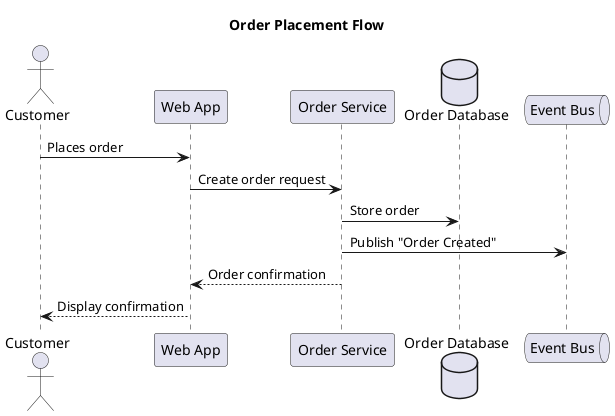
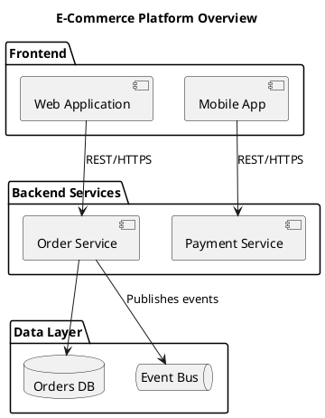
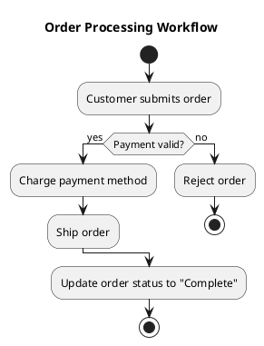
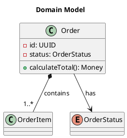
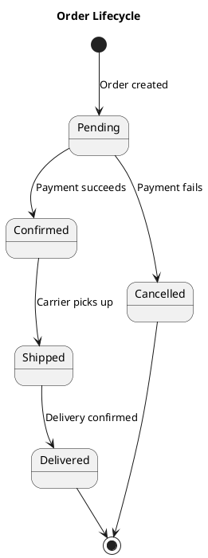

# PlantUML Diagramming

Match the project's existing conventions. When uncertain, check for existing `.puml` files to infer the local style -- naming, layout direction, theme usage, and abstraction level. Check for shared includes (`!include`) or a project theme file. These defaults apply only when the project has no established convention.

## References index

Deep-dive material lives alongside this file. Load the reference only when you need it.

- `references/sequence-diagrams.md` -- participants, arrows, activation, grouping, notes and dividers.
- `references/component-deployment.md` -- component and deployment diagrams, container types, interfaces.
- `references/activity-diagrams.md` -- basic activity flow, swimlane partitions, stereotype coloring rules.
- `references/class-diagrams.md` -- relationships table, full example, visibility modifiers, stereotypes, packages.
- `references/state-diagrams.md` -- lifecycle modeling, key syntax, concurrent regions.
- `references/other-diagram-types.md` -- use case, mindmap, gantt, WBS, ER, JSON/YAML visualization.
- `references/styling.md` -- modern `<style>` blocks, built-in themes, color formats, layout direction.
- `references/preprocessing.md` -- `!include`, `!procedure`, `!function`, variables, conditionals, loops.
- `references/anti-patterns.md` -- soft smells that need contextual judgment.

## Never rules

These are unconditional. They prevent broken or unreadable diagrams regardless of project style.

- **Never omit `@startuml`/`@enduml` delimiters** -- PlantUML silently fails or produces garbage without them. Every `.puml` file must start with `@startuml` and end with `@enduml` (or the equivalent for the diagram type: `@startmindmap`/`@endmindmap`, `@startgantt`/`@endgantt`, etc.).

- **Never use cryptic abbreviations or internal codenames as labels** -- use plain English that any team member understands. `AuthSvc` means nothing to a product manager; `Authentication Service` does. Labels are for humans, not compilers.

- **Never create diagrams with more than ~15 elements without grouping/nesting** -- overcrowded diagrams defeat the purpose. Use `package`, `rectangle`, `node`, `cloud`, or `together` to group related elements. If you cannot group meaningfully, split into multiple diagrams.

- **Never use legacy `skinparam` when `<style>` blocks achieve the same result** -- `skinparam` is deprecated. Use CSS-like `<style>` blocks for all visual customization. The only exception: edge cases where `<style>` does not yet support a specific property.

- **Never hardcode colors inline on individual elements** -- use stereotype-based `skinparam` or `<style>` blocks for consistency. Inline colors (`#FF0000` or `#CCFFCC` after `;`) on individual elements create maintenance nightmares, visual inconsistency, and often cause syntax errors in activity diagrams.

- **Never mix arrow direction keywords (`-up->`, `-down->`) with layout hacks** -- let PlantUML auto-layout first. Only add direction hints when the auto-layout result is genuinely unreadable. Overriding layout in multiple places creates conflicts that produce worse results than no hints at all.

- **Never use `autonumber` without explicit format** -- bare `autonumber` produces plain integers that add visual noise without aiding comprehension. Use a format string: `autonumber "<b>[000]"` or `autonumber 1 10 "<b>[00]"`.

- **Never omit participant declarations in sequence diagrams** -- undeclared participants render in source-order, which produces unpredictable layouts. Declare all participants at the top in the order you want them displayed.

- **Never write diagrams without a `title`** -- every diagram needs context for the reader. A diagram without a title is a screenshot without a caption.

## Audience and abstraction level

**Default to high-level, business-friendly diagrams.** The primary audience is non-technical team members and new joiners. Use business-friendly labels, simple relationships, and minimal jargon.

- Use full words: "Payment Service", not "PaySvc" or "pmtSvc"
- Show system boundaries and data flow, not implementation details
- Label arrows with business actions: "submits order", "sends notification"
- Omit method signatures, database column names, and class internals unless explicitly requested

**Only produce detailed/technical diagrams** (class diagrams with methods, database schemas, detailed state machines) when the user explicitly asks for a technical or detailed diagram. When in doubt, ask.

## Diagram type selection

| Scenario | Recommended Type | Why |
|----------|-----------------|-----|
| How systems or services interact over time | Sequence | Shows temporal ordering and message flow clearly |
| High-level system architecture or service boundaries | Component | Shows parts and their relationships without temporal ordering |
| Infrastructure and deployment topology | Deployment | Shows physical/cloud nodes and what runs where |
| Business process or workflow with decisions | Activity | Shows branching, parallel paths, and swimlanes |
| Object relationships and data modeling (technical) | Class | Shows inheritance, composition, and structure -- technical audiences only |
| Lifecycle of a single entity | State | Shows transitions and conditions for one stateful object |
| Feature scope or user goals | Use Case | Shows actors and what they can do at a glance |
| Brainstorming or knowledge structure | Mindmap | Non-linear, quick to create |
| Project timeline with dependencies | Gantt | Shows scheduling, milestones, and critical path |
| Work breakdown or deliverable hierarchy | WBS | Shows hierarchical decomposition of deliverables |
| Data relationships (technical) | ER (class with stereotypes) | Shows entities, attributes, and cardinality |

## Sequence diagrams

The most common type. Shows how components interact over time. Declare all participants at the top in display order.



See `references/sequence-diagrams.md` for participant types, the full arrow table, activation/deactivation, grouping (`alt`/`opt`/`loop`/`par`), notes, dividers, and delays.

## Component and deployment diagrams

Use these for high-level system architecture. Focus on boundaries and data flow, not internals.



See `references/component-deployment.md` for the full component example, deployment topology with `node`/`cloud`, container types (`node`, `cloud`, `database`, `package`, `rectangle`, `frame`), and interface/port syntax.

## Activity diagrams

Use for business processes, workflows, and decision flows. Swimlane partitions clarify responsibility per step.



**Key syntax:** `start`/`stop`, `:action;`, `if (condition?) then (yes) else (no) endif`, `fork`/`fork again`/`end fork`, `|Swimlane|`, floating notes with `floating note right: text`.

See `references/activity-diagrams.md` for the full example with parallel forks, swimlane partitions, and the stereotype-based coloring pattern (including the rule that inline `#color` after `;` causes syntax errors -- use `<<stereotype>>` instead).

## Class diagrams

**Technical diagrams only.** Use class diagrams when the user explicitly requests a technical or detailed diagram showing object relationships, inheritance, or data modeling.



See `references/class-diagrams.md` for the full relationships table (`<|--`, `*--`, `o--`, `-->`, `--`, `..|>`), complete example with visibility modifiers, stereotypes, and packaging.

## State diagrams

Use for modeling the lifecycle of a single entity -- orders, tickets, user accounts, deployments.



See `references/state-diagrams.md` for nested/composite states, pseudo-state syntax (`[*]`, `<<fork>>`, `<<join>>`, `<<choice>>`), and concurrent regions with the `--` separator.

## Other diagram types

Use case (feature scope), mindmap (brainstorming), gantt (timelines), WBS (deliverable hierarchy), ER (technical data relationships), and JSON/YAML visualization are all supported.

See `references/other-diagram-types.md` for complete examples of each.

## Styling

```plantuml
@startuml
title Styled Sequence Diagram

<style>
    sequenceDiagram {
        actor { BackgroundColor #E8F5E9 }
        participant { BackgroundColor #E3F2FD }
    }
</style>
...
@enduml
```

Use CSS-like `<style>` blocks instead of legacy `skinparam`. Place the style block immediately after `@startuml`:



Built-in themes work via `!theme cerulean` (or `plain`, `sketchy-outline`, `aws-orange`, `mars`, `minty`). For wide diagrams, set `left to right direction` after `@startuml`.

See `references/styling.md` for full `<style>` block examples, theme list, color formats, and layout direction rules.

## Preprocessing

Split large diagrams or share common definitions across files:

```plantuml
!include common/styles.puml
!include common/actors.puml
```

`!procedure`, `!function`, variables (`!$name = ...`), conditionals (`!if`/`!else`/`!endif`), and loops (`!while`/`!endwhile`) are all available.

See `references/preprocessing.md` for the full preprocessor syntax with examples.

## Anti-patterns

Soft smells that need contextual judgment (distinct from the unconditional Never rules above). The most common are overcrowded diagrams without grouping, technical jargon in business-level diagrams, mixed styling approaches, deep nesting beyond 3 levels, missing titles/legends, and duplicating content instead of using `!include`.

See `references/anti-patterns.md` for the full list with rationale.
