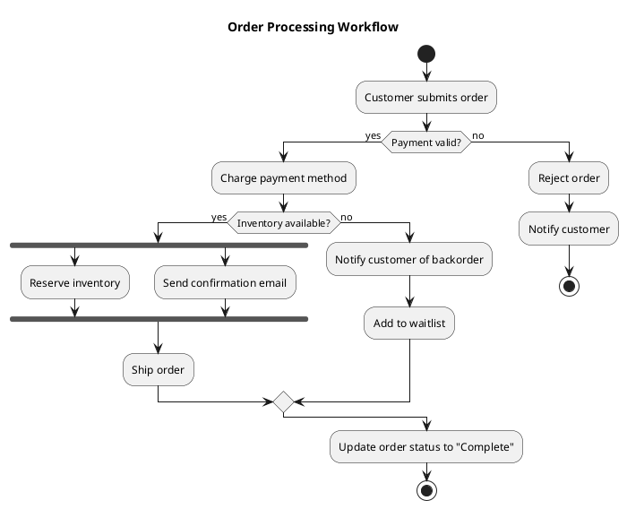
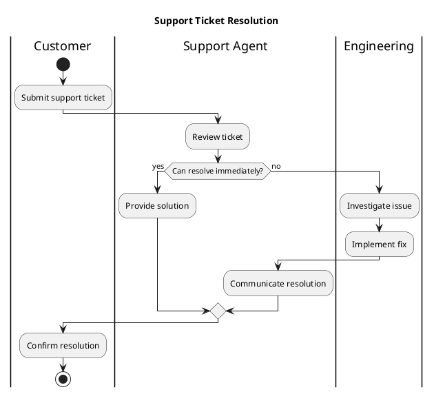
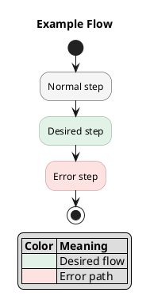

# Activity Diagrams

Use for business processes, workflows, and decision flows. Swimlane partitions make it clear who is responsible for each step.

## Basic flow

## Swimlanes with partitions

**Key syntax:** `start`/`stop`, `:action;`, `if (condition?) then (yes) else (no) endif`, `fork`/`fork again`/`end fork`, `|Swimlane|`, floating notes with `floating note right: text`.

## Coloring activity steps with stereotypes

To highlight specific paths (e.g., desired flow, error paths, regeneration vs new), use **stereotypes with skinparam**. Do NOT use inline `#color` after `;` — it causes syntax errors in activity diagrams.

**Rules:**
- Define stereotype colors in a `skinparam activity {}` block at the top
- Apply with `<<stereotype>>` after the `;` on the activity line
- Use a color legend table to explain meanings
- Common stereotypes: `<<desired>>`, `<<error>>`, `<<regen>>`, `<<newgen>>`, `<<fallback>>`
- `elseif` always requires `then` — omitting it causes syntax errors downstream
