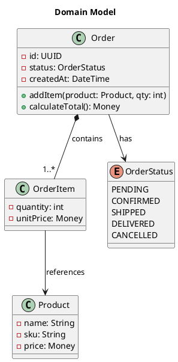

# Class Diagrams

**Technical diagrams only.** Use class diagrams when the user explicitly requests a technical or detailed diagram showing object relationships, inheritance, or data modeling.

## Relationships

| Syntax | Meaning | Use When |
|--------|---------|----------|
| `<\|--` | Extension/inheritance | "is a" relationship |
| `*--` | Composition | Part cannot exist without whole |
| `o--` | Aggregation | Part can exist independently |
| `-->` | Dependency | Uses temporarily |
| `--` | Association | General relationship |
| `..\|>` | Implements | Realizes an interface |

## Example



**Visibility modifiers:** `-` private, `+` public, `#` protected, `~` package-private.

**Stereotypes:** `<<interface>>`, `<<abstract>>`, `<<enum>>`, `<<service>>`, `<<entity>>`.

**Packages** group related classes:

```plantuml
package "Orders Domain" {
    class Order
    class OrderItem
}
```
