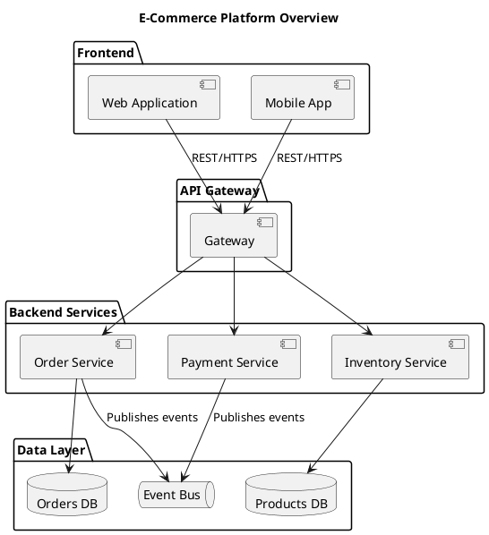
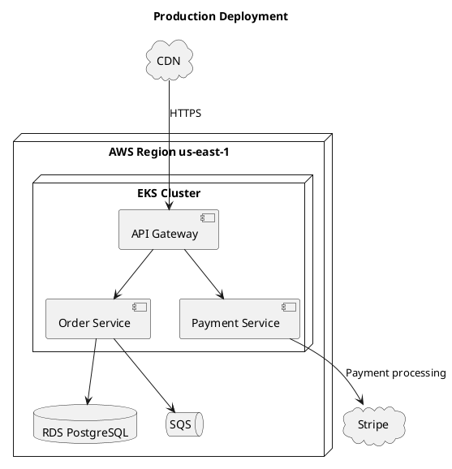

# Component and Deployment Diagrams

Use these for high-level system architecture. Focus on boundaries and data flow, not internals.

## Component diagram



## Deployment diagram



**Container types:** `node` (server/VM/container), `cloud` (external/cloud provider), `database` (data store), `package` (logical grouping), `rectangle` (generic boundary), `frame` (subsystem boundary).

Use `interface` or `()` for exposed ports:

```plantuml
() "REST API" as api
[Order Service] - api
```
