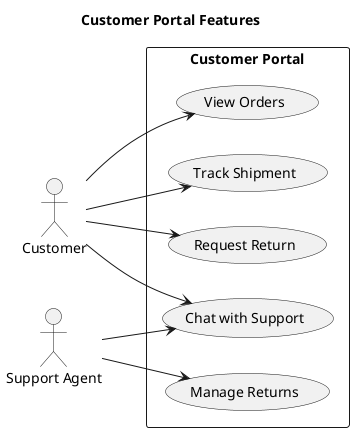
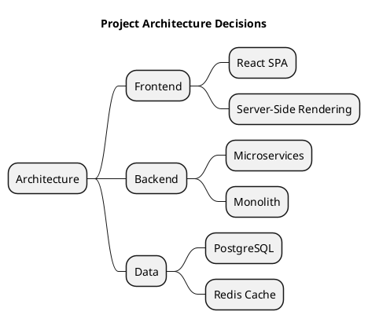
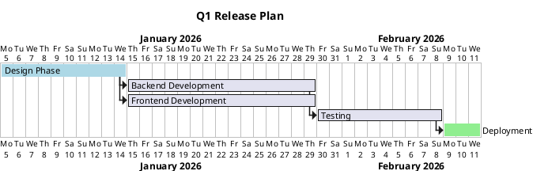
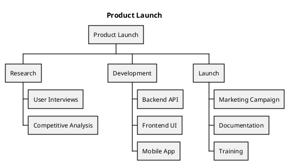
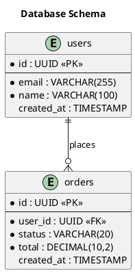
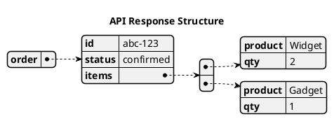

# Other Diagram Types

## Use case diagram

Good for feature scope and actor interactions at a glance:

## Mindmap

Quick brainstorming or knowledge structure:

## Gantt chart

Project timelines with dependencies:

## WBS (Work Breakdown Structure)

Hierarchical deliverable decomposition:

## ER diagram (using class diagram syntax)

## JSON and YAML visualization

