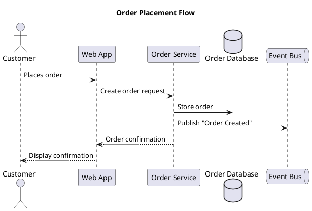

# Sequence Diagrams

Sequence diagrams are the most common type. They show how components interact over time.

## Participants

Declare all participants at the top in display order. Use the right stereotype for each:



**Participant types:** `actor` (human user), `participant` (generic service), `boundary` (system edge/API gateway), `control` (orchestrator/coordinator), `entity` (domain object/data), `database` (data store), `queue` (message broker), `collections` (grouped instances).

## Arrows

| Syntax | Meaning |
|--------|---------|
| `->` | Synchronous request (solid line, filled arrow) |
| `-->` | Synchronous response (dashed line, filled arrow) |
| `->>` | Asynchronous message (solid line, open arrow) |
| `-->>` | Asynchronous response (dashed line, open arrow) |
| `->x` | Lost message (message that goes nowhere) |
| `<->` | Bidirectional |

## Activation and deactivation

Use `activate`/`deactivate` or the shorthand `++`/`--` to show when a participant is processing:

```plantuml
Web -> Orders ++: Create order
Orders -> DB ++: INSERT order
DB --> Orders --: OK
Orders --> Web --: Order ID
```

## Grouping

Use grouping to show conditional and repetitive flows:

```plantuml
alt Payment succeeds
    Orders -> Payments: Charge card
    Payments --> Orders: Success
else Payment fails
    Payments --> Orders: Declined
    Orders --> Web: Payment failed
end

opt Customer has loyalty account
    Orders -> Loyalty: Award points
end

loop For each item in cart
    Orders -> Inventory: Reserve stock
end

par Parallel notifications
    Orders ->> Email: Send confirmation
    Orders ->> SMS: Send text
end
```

## Notes, dividers, and delays

```plantuml
note right of Orders: Validates inventory\nbefore charging
note over Web, Orders: All communication over HTTPS

== Fulfillment Phase ==

...Warehouse picks and packs order...

Shipping -> Customer: Delivery notification
```
