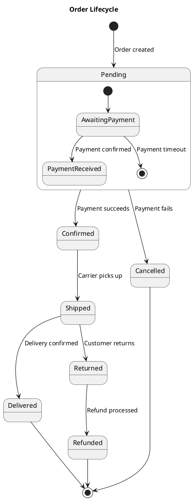

# State Diagrams

Use for modeling the lifecycle of a single entity -- orders, tickets, user accounts, deployments.



## Key syntax

- `[*]` -- initial and final pseudo-states
- `state Name { }` -- composite/nested states
- `state "Long Name" as alias` -- aliasing for readability
- `state fork_point <<fork>>` / `<<join>>` -- concurrent region fork/join
- `state choice_point <<choice>>` -- decision point

## Concurrent regions

```plantuml
state Processing {
    state "Verify Payment" as vp
    state "Check Inventory" as ci
    [*] --> vp
    [*] --> ci
    vp --> [*]
    ci --> [*]
    --
    state "Send Notification" as sn
    [*] --> sn
    sn --> [*]
}
```
