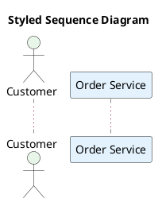

# Styling

## Modern `<style>` blocks (preferred)

Use CSS-like `<style>` blocks instead of legacy `skinparam`. Place the style block immediately after `@startuml`:



## Built-in themes

PlantUML ships with themes. Use `!theme` to apply one:


Common themes: `cerulean`, `plain`, `sketchy-outline`, `aws-orange`, `mars`, `minty`. Preview themes before committing to one.

## Color formats

- Named colors: `Red`, `LightBlue`, `DarkGreen`
- Hex: `#FF5733`, `#2196F3`
- Gradients: `#White/#LightBlue` (top to bottom)

## Layout direction

Default is top-to-bottom. For wide diagrams with many horizontal relationships:

```plantuml
left to right direction
```

Add this immediately after `@startuml` (before any elements).
